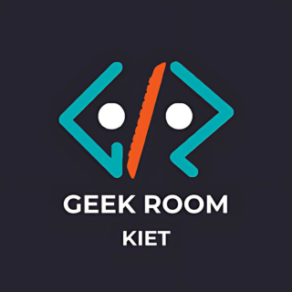

  

<h1 align="center">Welcome to Geek Room 🚀</h1>

  <strong>Learn • Connect • Grow </strong>
   
  <em>The official GitHub home for a thriving tech community of innovators, builders, and learners! </em>
   
  💻✨🤝

---

Hey there, fellow tech enthusiast! Welcome to the Geek Room GitHub organization. We are a bustling hub for passionate individuals who are eager to learn, build, and grow together in the ever-evolving world of technology. Whether you're a coding newbie or a seasoned pro, you've found your tribe!

### 💡 What is Geek Room?

Geek Room is more than just a community; it's a movement! We are a student-led group dedicated to creating a vibrant ecosystem for innovation and collaboration.

* Hackathons & Competitions:
* Workshops & Events:
* Knowledge-Sharing Sessions:
* Networking Meetups:

### 🏆 Our Supporters & Past Sponsors

We are proud to have collaborated with amazing organizations and institutions to bring our events to life. A huge shout-out to some of our past sponsors who believe in our vision:

* Microsoft
* GitHub
* Devfolio
* Physics Wallah

### 🛠️ Contributions

We welcome contributions from all members of the community. Whether you're an experienced developer or just starting, we have plenty of opportunities for you to get involved. Check out our contribution guidelines and join our community! 🤝
 

Ready to jump in? Check out our repositories and see where you can make your mark. 
---

  Thanks for stopping by! Let's continue to learn, connect, and grow together. 🚀🌟

